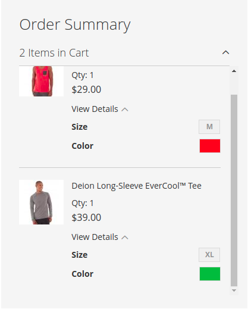

# Checkout Swatches for Magento 2

## Overview

This package changes default product text details (size, color) to swatches in minicart and on checkout.



## Installation

1. Install with composer `composer require magently/checkout-swatches-magento2`
2. Run the following commands:
```
php bin/magento setup:upgrade
php bin/magento setup:di:compile
php bin/magento setup:static-content:deploy
php bin/magento cache:flush
```
3. Check with ```cat app/etc/config.php | grep Magently_CheckoutSwatches``` whether module is installed and enabled.
